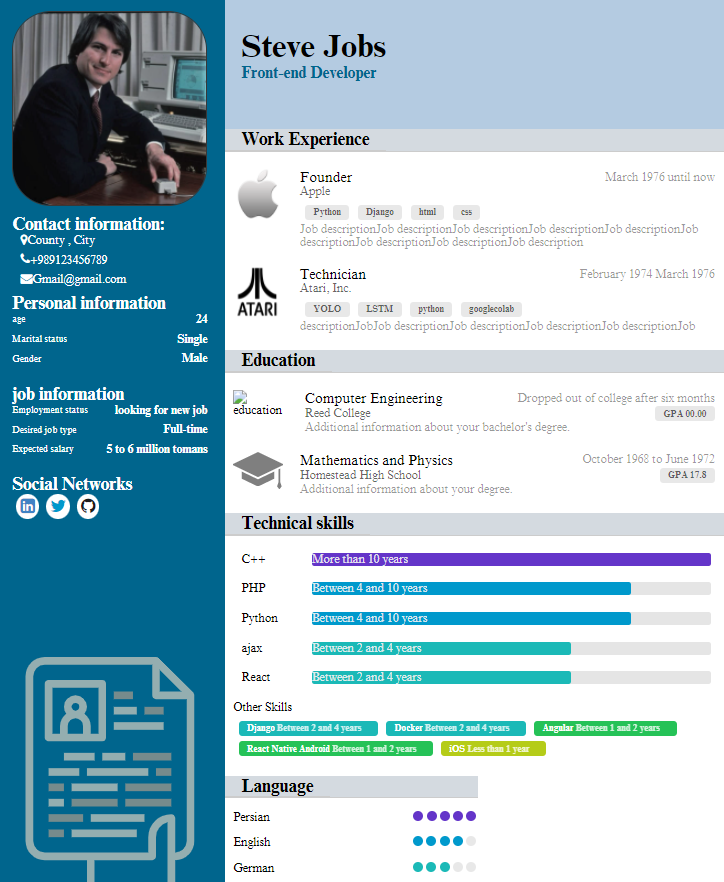

# HTML_CSS_CV
A simple single-page resume template done purely with HTML and CSS

  

## Fonts
The font used in the resume is "times new roman" and the font file is also in the "assets" folder.

## Output Demo

  

## Credits
feel free to use any part of this repo for your use.

